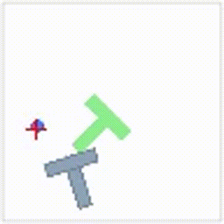
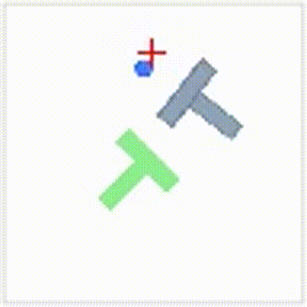
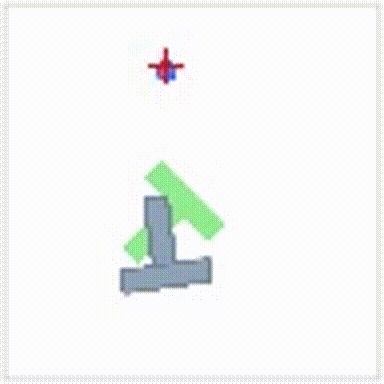
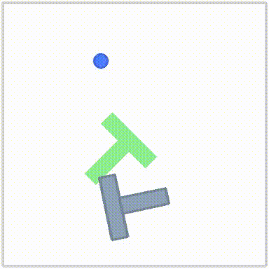

# Diffusion Policy for PushT Task

## Overview

This repository documents implementation of the Diffusion Policy, training and evaluating a Diffusion Policy on the provided PushT dataset.

## Repository Structure

```
.
├── README.md                              (this file)
├── docker/
│   ├── build.sh
│   └── ...
├── src/                                   (helper scripts)
│   ├── zarr_to_lerobotv3.py
│   └── ...
├── Dataset/
│   └── zarr/
│       ├── pusht_cchi_v1.zarr.zip
│       └── pusht_cchi_v2.zarr.zip
└── outputs/                               (created during training/eval)
    ├── train/
    └── eval/
```

## Quick Start

### 1. Clone and Setup
```bash
git clone https://github.com/jerrychang-jh/Diffusion-Policy-PushT.git
cd Diffusion-Policy-PushT
source unzip_original_dataset.sh
```

### 2. Build Docker Environment
```bash
source docker/build.sh
source docker/lerobot_stanford_gpu_run_attach.sh
```

## Repository Setup

### Clone and Data Preparation
```bash
git clone https://github.com/jerrychang-jh/Diffusion-Policy-PushT.git
cd Diffusion-Policy-PushT
source unzip_original_dataset.sh
```

### Building Docker Image
```bash
# From repository root (may take some time)
source docker/build.sh
source docker/lerobot_stanford_gpu_run_attach.sh
```

## Training & Evaluation

### Original Diffusion Policy

**Setup Environment:**
```bash
conda activate robodiff
```

**Training:**
```bash
source train_stanford.sh
```

**Evaluation:**
```bash
source eval_stanford.sh
```

## Known Issues

1. **LeRobot Dataset Mismatch**: The converted LeRobot-v3 dataset has dimensionality mismatch issues during evaluation

### LeRobot-based Implementation (currently have issues)

**Convert Dataset:**
```bash
source convert_zarr_to_lerobot-v3.sh
source patch_converted_lerobot_dataset.sh
```

**Training:**
```bash
source train_lerobot.sh
```

**Evaluation:**
```bash
source eval_lerobot.sh
```

## Results

Evaluation (Stanford eval logs):

| Dataset | Episodes | Mean Score | Success Rate (>=0.95) | Preview |
|---------|----------:|-----------:|----------------------:|:------:|
| pusht_cchi_v1 | 50 | 0.837 | 64% (32/50) |  |
| pusht_cchi_v2 | 50 | 0.836 | 64% (32/50) |  |

Notes: Mean Score is the normalized episode score (0–1) from `outputs/eval/stanford/*/eval_log.json`. Success rate counts episodes with `sim_max_reward >= 0.95` (interpreted as successful trials). Full per-episode values and rollout videos are available under the corresponding `outputs/train/stanford/.../eval/` folders. There is also a separate raw-reward summary at `outputs/eval/diffusion_pusht/last/eval_info.json` (100-episode run), but the Stanford eval logs are used as the canonical submission metrics.

## Key Observations & Analysis

The model demonstrates learning in distinct phases:

1. **Corner Alignment Phase**: Initial focus on aligning the box corner with the target corner
   

2. **Edge Alignment Phase**: Refinement to align the box edge with the target edge
   

This progressive learning suggests the policy develops a hierarchical understanding of the manipulation task.

## References

- **Official Diffusion Policy**
  - Paper: [https://arxiv.org/abs/2303.04137](https://arxiv.org/abs/2303.04137)
  - Project page: [https://diffusion-policy.cs.columbia.edu/](https://diffusion-policy.cs.columbia.edu/)
  - Official codebase: [https://github.com/real-stanford/diffusion_policy](https://github.com/real-stanford/diffusion_policy)

- **PushT Environment (HuggingFace Gym)**
  - Task environment: [https://github.com/huggingface/gym-pusht](https://github.com/huggingface/gym-pusht)

- **LeRobot**
  - An alternative robotics learning framework [https://github.com/huggingface/lerobot](https://github.com/huggingface/lerobot)

- **forge**
  - Robotics Data Format Converter [https://github.com/arpitg1304/forge](https://github.com/arpitg1304/forge)
